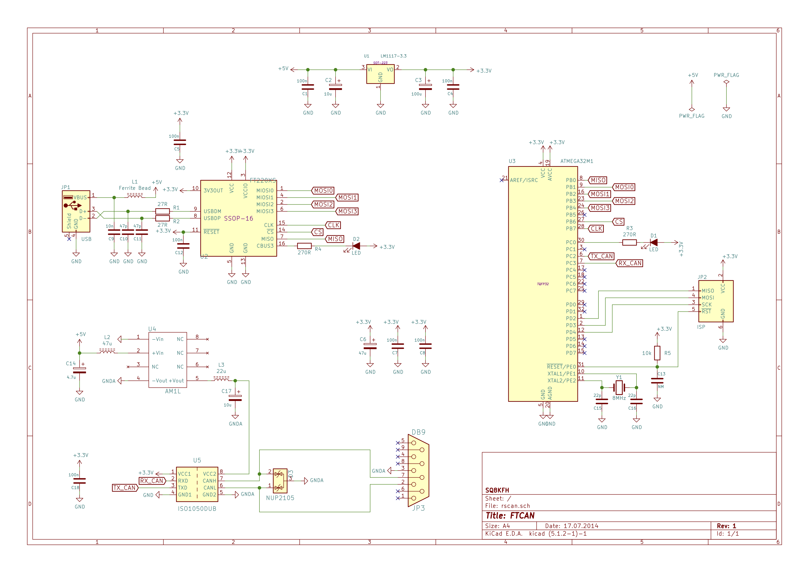

# FTCAN

## Overview
The FTCAN is a firmware for USB to CAN adapter base on the FTDI FT220X and the Atmel ATmega32M1.
The FTCAN is compatible with the SLCAN (Serial Line CAN Protocol).

## Supported command

| CMD | STATUS | SYNTAX              | DESCRIPTION                                        |
|:---:|:------:|---------------------|----------------------------------------------------|
|  S  |        | Sn[CR]              | Setup with standard CAN bit-rates where n is 0-8.  |
|     |  TODO  |                     | S0 10Kbit                                          |
|     |  TODO  |                     | S1 20Kbit                                          |
|     |  TODO  |                     | S2 50Kbit                                          |
|     |        |                     | S3 100Kbit                                         |
|     |        |                     | S4 125Kbit  (default)                              |
|     |        |                     | S5 250Kbit                                         |
|     |        |                     | S6 500Kbit                                         |
|     |  TODO  |                     | S7 800Kbit                                         |
|     |        |                     | S8 1Mbit                                           |
|  O  |        | O[CR]               | Open the CAN channel                               |
|  C  |        | C[CR]               | Close the CAN channel                              |
|  t  |        | tiiildd...[CR]      | Transmit a standard (11bit) CAN frame              |
|  T  |        | Tiiiiiiiildd...[CR] | Transmit an extended (29bit) CAN frame             |
|  r  |        | riiil[CR]           | Transmit an standard RTR (11bit) CAN frame         |
|  R  |        | Riiiiiiiil[CR]      | Transmit an extended RTR (29bit) CAN frame         |
|  F  |        | F[CR]               | Read status flags (CANGSTA)                        |
|  M  |  TODO  | Mxxxxxxxx[CR]       | Sets Acceptance Code Register                      |
|  m  |  TODO  | mxxxxxxxx[CR]       | Sets Acceptance Mask Register                      |
|  V  |        | v[CR]               | Get hardware/software version number               |
|  v  |        | V[CR]               | Get software major and minor version number        |
|  N  |  TODO  | N[CR]               | Get serial number of the FT220X                    |

## FTCAN hardware

### Schema

### Hardware

